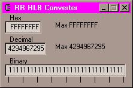



## VB, Assembler & Resource files

### Description

VB, Assembler & Resource files by Robert Rayment

(see small update below)

Only those interested in this topic should download these files.

If you have been following some of the VB+assembler progs

I've been putting on PSC you may have noticed that the assembly

part is either in a bin file (com in earlier examples) or in a DLL.

The disadvantage of both these is that they need to be in the same

folder as the prog. This is OK for testing but is a nuisance for an

EXE. Also we're usually talking about small bits of assembler to

beef up parts of VB (Heineken approach). The DLL may be

specific and so is not appropriate to register. Assembled snippets

are often much faster than VB. Also, once you've got over the

red-tape and peculiarities of the particular assembler, its often

_easier_ (this may be a secret so don't tell anyone)

A DLL has a minimum size of 16KB and a bin file 4KB (cluster size).

What this submission shows is how to put your assembler code into a

resource file which gets incorporated into an EXE freeing it from

associations and only taking a few more bytes than the bin file size.

A 32-bit Hex/Long integer/Binary converter is developed to demonstrate

these techniques. The zip file is ~11KB.

UPDATE: it is possible to simplify the load from res by

InCode = LoadResData(101, "CUSTOM")

lpMCode = VarPtr(InCode(0))

avoiding the save to disc. Make sure to delete the line lpMCode = VarPtr(InCode(1))
 
### More Info
 
Shows use of resource files

Number conversion

             |
---                |---
**Submitted On**   |2000-12-17 11:19:36
**By**             |[Robert Rayment](https://github.com/Planet-Source-Code/PSCIndex/blob/master/ByAuthor/robert-rayment.md)
**Level**          |Advanced
**User Rating**    |4.1 (29 globes from 7 users)
**Compatibility**  |VB 6\.0
**Category**       |[Miscellaneous](https://github.com/Planet-Source-Code/PSCIndex/blob/master/ByCategory/miscellaneous__1-1.md)
**World**          |[Visual Basic](https://github.com/Planet-Source-Code/PSCIndex/blob/master/ByWorld/visual-basic.md)
**Archive File**   |[CODE\_UPLOAD1277512172000\.zip](https://github.com/Planet-Source-Code/robert-rayment-vb-assembler-resource-files__1-13663/archive/master.zip)

### API Declarations

CallWindowsProc

